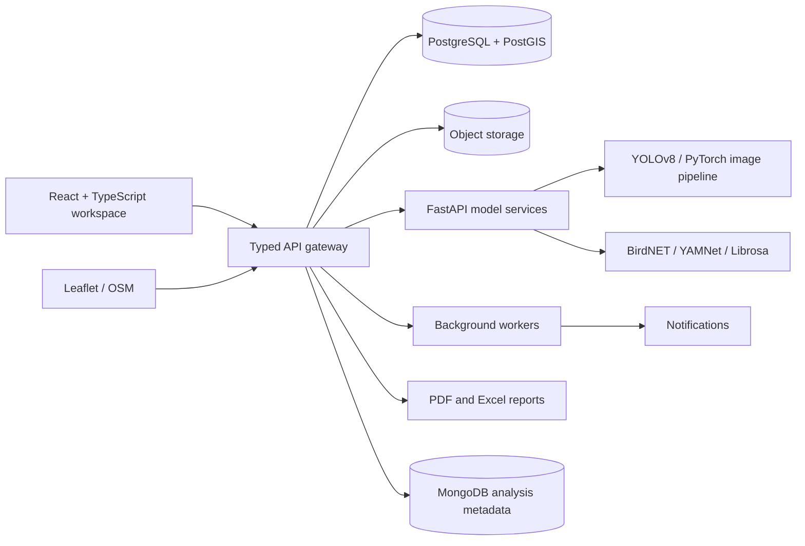

# Architecture Overview

## Bounded contexts

1. **Identity and access** — OAuth2/OIDC provider, JWT access tokens, refresh-token rotation, and roles.
2. **Field operations** — users, protected areas, monitoring locations, surveys, devices, and observations.
3. **Model intelligence** — image detection, species classification, bioacoustic recognition, confidence scoring, and model versioning.
4. **Ecological intelligence** — diversity indices, density estimates, population trends, habitat health, and ecosystem health.
5. **Decision support** — recommendations, alerts, patrol priorities, reports, and dashboards.

## Non-functional goals

- Every detection is traceable to a survey, location, device or field source, model version, and confidence score.
- Heavy inference is asynchronous and idempotent.
- Uploaded bytes live in object storage; relational tables store metadata and object paths.
- PostGIS stores canonical point and polygon geometry; MongoDB stores flexible model output and spectrogram metadata.
- APIs expose least-privilege role checks and audit events.
