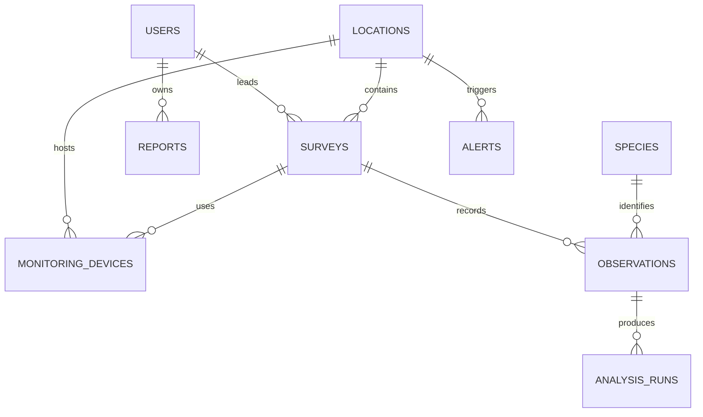

# Database Design

## PostgreSQL / PostGIS

The Drizzle schema at `lib/db/src/schema/index.ts` is the source of truth for the relational core:

`users -> surveys -> monitoring_devices`, `locations -> surveys`, `species -> observations`, `observations -> analysis_runs`, `locations -> alerts`, and `users -> reports`.

In a production PostGIS migration, add:

```sql
CREATE EXTENSION IF NOT EXISTS postgis;
ALTER TABLE locations ADD COLUMN IF NOT EXISTS geom geometry(Point, 4326);
CREATE INDEX IF NOT EXISTS locations_geom_gix ON locations USING GIST (geom);
CREATE INDEX IF NOT EXISTS observations_observed_at_idx ON observations (observed_at DESC);
CREATE INDEX IF NOT EXISTS observations_species_idx ON observations (species_id);
CREATE INDEX IF NOT EXISTS surveys_status_idx ON surveys (status);
CREATE INDEX IF NOT EXISTS alerts_unacknowledged_idx ON alerts (acknowledged, created_at DESC);
```

## MongoDB collections

- `analysis_runs`: flexible model payloads, bounding boxes, spectrogram features, embeddings, and raw provider responses.
- `model_versions`: model name, checksum, training dataset, metrics, and deployment status.
- `recommendation_explanations`: feature contributions and generated conservation rationale.
- `audit_events`: immutable request, actor, entity, and before/after metadata.

## Indexing strategy

- B-tree: status, timestamps, scientific name, role, and foreign keys.
- GiST: PostGIS locations and protected-area polygons.
- Partial index: unacknowledged alerts.
- Compound Mongo indexes: `{ surveyId: 1, createdAt: -1 }`, `{ model: 1, status: 1 }`.
- Retention policy: raw inference logs and high-frequency device pings are archived after the configured research retention window.

## ER diagram


